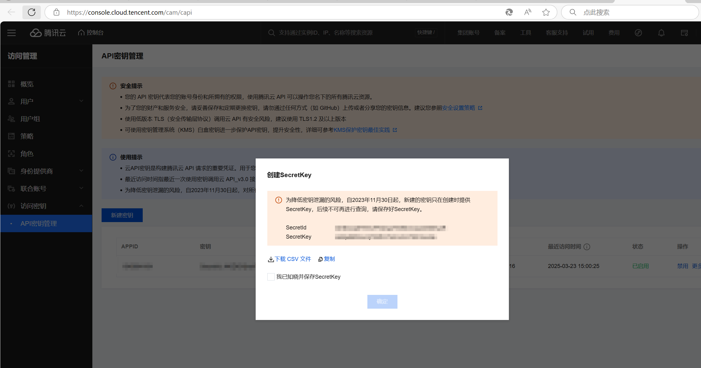
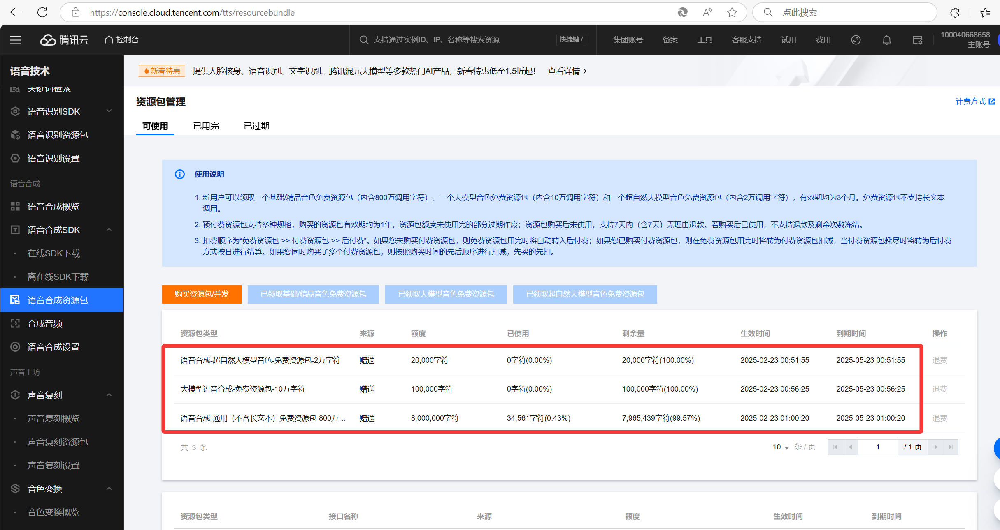

# 腾讯云语音合成工具

这是一个使用腾讯云 TTS（文本转语音）服务的命令行工具，可以将文本文件转换为多种格式的音频文件。

## 功能特点

- 使用腾讯云 TTS API 进行高质量语音合成
- 支持多种音色选择（通过音色ID指定）
- 自动将长文本分段处理，保持语句完整性
- 支持多种输出格式（WAV, MP3, AAC, M4A, OGG, FLAC等）
- 可指定输出路径和文件名

## 安装和设置

### 前提条件

- Python 3.6 或更高版本
- FFmpeg（用于音频处理）
  - 官方下载地址：https://ffmpeg.org/download.html
- 腾讯云账号及 TTS 服务的访问凭证
  - **注册腾讯云账号**：
    1. 访问 [腾讯云官网](https://cloud.tencent.com/) 并点击右上角的"注册"按钮
    2. 按照指引完成账号注册和实名认证
  
  - **开通腾讯云 TTS 服务**：
    1. 登录腾讯云控制台
    2. 在搜索栏中搜索"语音合成"或直接访问 [语音合成控制台](https://console.cloud.tencent.com/tts)
    3. 按照提示开通服务（新用户通常有免费额度）
    4. 当然，其实你可以直接在线合成，还可以听听不同音色的差别:[在线合成](https://console.cloud.tencent.com/tts/complexaudio).这个项目只是众多流程的一个小步骤所以我用脚本合成比较方便。
  
  - **获取访问凭证（SecretId 和 SecretKey）**：
    1. 访问 [API密钥管理](https://console.cloud.tencent.com/cam/capi)
    2. 点击"新建密钥"按钮创建一对新的SecretId和SecretKey，或使用已有的密钥
    3. 将获取到的SecretId和SecretKey保存好，用于后续配置
    
    
  
  - **查看服务配额和计费信息**：
    1. 在 [语音合成控制台](https://console.cloud.tencent.com/tts/overview) 可查看当前的用量和剩余免费额度
    2. 了解 [计费规则](https://cloud.tencent.com/document/product/1073/34112)，避免产生意外费用
    
    

### 安装步骤

1. 克隆或下载本项目到本地

2. 安装所需的Python依赖：
   ```
   pip install tencentcloud-sdk-python
   ```

3. 确保FFmpeg已安装并可在系统路径中找到，或将其放置在项目的`Softwares/ffmpeg/bin/`目录下

4. 在`Config`目录下创建腾讯云凭证文件：
   - 创建`tencent_cloud_secret_key.csv`文件，包含您的SecretId和SecretKey
   - 创建`tencent_cloud_voice_type.csv`文件，包含音色ID和对应的名称（可选）

   CSV文件格式示例：
   ```
   SecretId,SecretKey
   your_secret_id,your_secret_key
   ```

## 使用方法

### 基本用法

```
python audio_generator.py -f <文本文件路径> [-o <输出文件路径>] [-v <音色ID>]
```

### 参数说明

- `-f, --file`: **必需参数**，指定要转换为语音的文本文件路径
- `-o, --output`: 可选参数，指定输出文件的完整路径和格式（通过文件后缀决定格式，如：output.mp3）。如果不指定，将在输入文件的同一目录下生成同名但后缀为.wav的音频文件
- `-v, --voice`: 可选参数，指定腾讯云的音色ID，默认为101011，音色ID和对应的角色可查看config/tencent_cloud_voice_type.csv,也可在线试听https://console.cloud.tencent.com/tts/complexaudio

### 支持的输出格式

- WAV (默认格式)
- MP3
- AAC/M4A
- OGG
- FLAC
- 其他FFmpeg支持的格式

### 示例

1. 基本使用（默认在输入文件同目录下输出同名.wav文件）：
   ```
   python audio_generator.py -f Text/my_text.txt
   ```
   这将生成 `Text/my_text.wav` 文件

2. 指定输出为MP3格式：
   ```
   python audio_generator.py -f Text/my_text.txt -o myaudio.mp3
   ```

3. 指定完整输出路径和格式：
   ```
   python audio_generator.py -f Text/my_text.txt -o C:/Users/MyName/Desktop/output.aac
   ```

4. 指定不同的音色：
   ```
   python audio_generator.py -f Text/my_text.txt -v 101016
   ```

## 注意事项

- 文本文件请使用UTF-8编码
- 确保有足够的磁盘空间用于临时文件和最终输出
- 长文本会被自动分段处理，每段不超过150字符
- 使用腾讯云服务可能产生费用，请参考腾讯云的计费规则

## 故障排除

### "系统找不到指定的文件"错误

如果遇到"语音合成失败: [WinError 2] 系统找不到指定的文件"错误，请检查以下几点：

1. **配置文件名称**：
   - 确保在`Config`目录下创建了正确名称的配置文件：
     - `tencent_cloud_secret_key.csv`
     - `tencent_cloud_voice_type.csv`

2. **FFmpeg路径问题**（最常见原因）：
   - 错误信息显示"片段合成成功"后报错，通常是FFmpeg路径问题
   - 解决方法：
     1. 确认FFmpeg已安装并放置在正确位置：
        ```
        [项目根目录]/Softwares/ffmpeg/bin/ffmpeg.exe
        ```
     2. 或修改代码中的FFmpeg路径：
        在`audio_generator.py`文件中找到这两行：
        ```python
        ffmpeg_path = os.path.abspath(os.path.join(base_dir, "Softwares", "ffmpeg", "bin", "ffmpeg.exe"))
        ffprobe_path = os.path.abspath(os.path.join(base_dir, "Softwares", "ffmpeg", "bin", "ffprobe.exe"))
        ```
        修改为您系统中FFmpeg的实际路径，例如：
        ```python
        ffmpeg_path = "C:/Program Files/ffmpeg/bin/ffmpeg.exe"
        ffprobe_path = "C:/Program Files/ffmpeg/bin/ffprobe.exe"
        ```
     3. 或者将FFmpeg添加到系统PATH环境变量中，然后修改代码使用简单路径：
        ```python
        ffmpeg_path = "ffmpeg"
        ffprobe_path = "ffprobe"
        ```

3. **目录结构**：
   - 确保项目目录结构正确：
     ```
     TecentCloud_Audio_generator\
     ├── audio_generator.py
     ├── Config\
     │   ├── tencent_cloud_secret_key.csv
     │   └── tencent_cloud_voice_type.csv
     ├── test\
     │   └── testFile.txt
     └── Softwares\
         └── ffmpeg\
             └── bin\
                 ├── ffmpeg.exe
                 └── ffprobe.exe
     ```

4. **权限问题**：
   - 确保程序有权限访问所有必要的文件和目录
   - 尝试以管理员身份运行命令提示符或PowerShell

5. **其他问题**
   - 腾讯云语音相关问题请访问：https://cloud.tencent.com/document/product/1073/34090